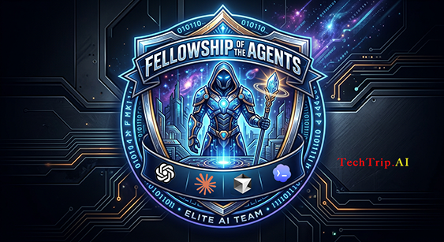

# techtrip-secondbrain

<p align="center">
  
</p>

> [!IMPORTANT]
> **New release: v0.2.7 (2026-07-15) — GitHub Copilot CLI harness parity**: the
> vault now stamps `.github/hooks/` ports of the claude-obsidian hooks, so
> Copilot CLI gets the same invisible automation as Claude Code — `wiki/hot.md`
> injected at session start, auto-commit after edits, and a hot-cache refresh
> reminder at stop. Re-run `/secondbrain` (or `bash bin/setup-harnesses.sh
> <vault>` for git clones) to stamp them into an existing vault.
> Rides on 0.2.6's voice memos (`voice-fetch`, fully on-device WhisperKit
> transcription) and 0.2.5's maintenance release (`/brain-dump` upkeep §10,
> two-machine sync §12, `doctor` content checks, fork v1.9.3 `wiki-delete` /
> `wiki-archive` / source retraction).
> **Still on 0.1.0?** v0.2.0 removed Syncthing support — git
> is now the only sync path — so update now; see
> [Updating an existing secondbrain](#updating-an-existing-secondbrain):
> [via the plugin marketplace](#if-you-installed-via-the-marketplace-most-people)
> (most people) or [via a local git clone](#if-you-cloned-the-git-repo).
> Nothing on your machine is uninstalled by the update; if your vault has a
> leftover `.stignore` from 0.1.0, `bin/setup-sync.sh` offers to remove it.
> Full details in the [CHANGELOG](CHANGELOG.md).

> [!NOTE]
> **Now installs from a maintained fork.** As of this release, techtrip-secondbrain installs
> [`claude-obsidian`](https://github.com/AgriciDaniel/claude-obsidian) (by
> [AgriciDaniel](https://github.com/AgriciDaniel), MIT) from a lightly-patched fork we
> maintain — [`TechTripAi/claude-obsidian`](https://github.com/TechTripAi/claude-obsidian) —
> rather than directly from upstream. Upstream is backlogged on bug fixes (e.g. an invalid
> `SessionStart` hook that errors at launch, [issue #116](https://github.com/AgriciDaniel/claude-obsidian/issues/116)),
> and installing his current build breaks on setup. The fork carries **bug fixes only** — no
> feature divergence — tracks upstream for periodic sync, and stays under AgriciDaniel's
> copyright + MIT license. Fixes are filed upstream too. Already on the upstream copy?
> `bin/setup-claude-obsidian.sh` (and `bin/doctor.sh`) detect it and offer a one-step migration.

**One-command bootstrapper for a generic, out-of-the-box LLM Wiki "second brain" on a
fresh Mac.** It installs Obsidian and a select set of community plugins, pulls the
[**`claude-obsidian`**](https://github.com/AgriciDaniel/claude-obsidian) plugin — by
[**AgriciDaniel**](https://github.com/AgriciDaniel), MIT — from a **lightly-patched fork
TechTrip maintains** ([`TechTripAi/claude-obsidian`](https://github.com/TechTripAi/claude-obsidian),
bug-fixes-plus-proposed-PRs, tracks upstream), scaffolds a clean vault, wires the Obsidian MCP server, ships the `yt-fetch`,
`voice-fetch`, and `notebooklm-ingest` source skills plus the `new-idea` origination
scaffolder, and sets up git sync + backup — all interactive and idempotent.

> **TechTrip Second Brain is an orchestrator.** It installs the
> [`claude-obsidian`](https://github.com/AgriciDaniel/claude-obsidian) LLM Wiki runtime
> ([AgriciDaniel](https://github.com/AgriciDaniel), MIT) at setup time — from a
> **lightly-patched fork we maintain** ([TechTripAi/claude-obsidian](https://github.com/TechTripAi/claude-obsidian))
> that carries bug fixes upstream is backlogged on (fixes only, no feature divergence;
> tracks upstream for sync, and fixes are filed upstream too). It fills only the OS-level
> and sync gaps the plugin leaves to you — nothing of his is copied into this repo. The
> MVP produces a **generic empty scaffold** (no personal content) that you grow yourself.
> Credits: [ATTRIBUTION.md](ATTRIBUTION.md).

## Why this exists

`techtrip-secondbrain` does exactly five things — it makes `claude-obsidian` easy to
install and use, with some added functionality:

1. **Automates installation** of `claude-obsidian` and everything around it
   (Obsidian, community plugins, dependencies, MCP wiring, sync).
2. **Prechecks and post-checks** — `precheck` audits the machine before setup, and
   `doctor`/`repair-mcp` diagnose and fix anything broken after.
3. **Adds three ingest options** claude-obsidian doesn't ship: `yt-fetch` (YouTube
   transcripts), `voice-fetch` (on-device audio transcription), and
   `notebooklm-ingest` (NotebookLM synthesis).
4. **Adds origination** — `/new-idea` scaffolds a greenfield project
   (thesis → decisions → spec) for the ideas *you* originate, the generative
   front-half that graduates back into the ingest pipeline.
5. **Teaches you the wiki** — `/brain-dump`, a guided tutorial that walks a new user
   through every ingestion type, topic research with `/autoresearch`, starting a
   new idea, and the maintenance workflow.

## What is a "second brain"?

The pattern comes from Andrej Karpathy's [**LLM Wiki**](https://gist.github.com/karpathy/442a6bf555914893e9891c11519de94f):
instead of dumping documents into a store and re-searching the raw pile on every
question, an LLM **incrementally maintains a persistent wiki** — a compounding artifact
of your own knowledge. Three layers: **raw sources** you curate, the **wiki** of
LLM-written, cross-linked markdown pages, and a **schema** that governs how it's
organized. You *ingest* a source (the model reads it and updates a handful of pages),
*query* it (the model synthesizes an answer and files anything worth keeping back into
the wiki), and *lint* it (health-checks for contradictions, staleness, and orphans).

Karpathy's insight is why this only works now: knowledge bases have always failed
because "the maintenance burden grows faster than the value" — humans abandon them out
of tedium. An LLM doesn't. It does the bookkeeping so the knowledge compounds instead of
being re-derived each time; you curate sources and direct the analysis. `claude-obsidian`
implements this pattern in Obsidian, and `techtrip-secondbrain` stands the whole thing
up for you. *(See Karpathy's gist for the original write-up.)*

## What is Obsidian?

[**Obsidian**](https://obsidian.md) is a free, local-first note-taking app that stores
everything as plain **Markdown files in a folder on your disk** — that folder is called a
**vault**. There's no proprietary database and no mandatory cloud: your notes are just
`.md` files you fully own, readable and editable by any tool (including Claude). Obsidian
treats `[[wikilinks]]` between notes as first-class, so a vault naturally becomes a
**graph of interconnected pages** rather than a flat pile of documents — exactly the
shape an LLM Wiki wants.

Two things make it the right home for a second brain: **it's just files** (so Claude can
read and write pages directly, and git can version every change), and **it's extensible**
via community plugins and a Local REST API. `techtrip-secondbrain` leans on both — it
installs Obsidian plus a curated set of community plugins, then wires the REST API so the
`obsidian` MCP server lets Claude operate on the vault. In this stack Obsidian is the
**human-facing surface** (you read, browse, and edit notes there) while `claude-obsidian`
is the LLM that maintains them behind the scenes.

## How TechTrip-SecondBrain Makes Life Easy

`claude-obsidian` gives you the wiki runtime but leaves the machine setup to you.
`techtrip-secondbrain` closes that gap:

- **Zero-touch OS setup** — installs Obsidian, the community plugins, and every binary
  dependency (`uv`, `node`, `flock`, `python3`, optional `yt-dlp`/`whisperkit-cli`) via Homebrew, all idempotent.
- **Turnkey MCP wiring** — generates the Local REST API key and registers the `obsidian`
  MCP server so Claude can read and write the vault out of the box — no hand-editing
  `~/.claude.json`.
- **Source-ingestion skills** — ships `yt-fetch` (YouTube), `voice-fetch` (voice
  memos / local audio, transcribed on-device), and `notebooklm-ingest`
  (NotebookLM) as first-class skills for pulling material into the vault.
- **Origination skill** — ships `/new-idea`, which scaffolds a greenfield project
  (`wiki/projects/<slug>/`: tracker, thesis workbench, open questions, append-only
  decisions log, spec) from a seeded template for the ideas you originate yourself;
  the seeded `origination-workflow` page documents the loop
  (Frame → Mull → Decide → Reconcile → Log → Graduate), and `doctor` nudges stale
  projects toward graduate-or-archive.
- **Guided onboarding** — ships `/brain-dump`, an instructional tutorial that walks you
  through every ingestion type, `.raw/`, the hot cache, starting a new idea, keeping
  the vault lean, and turning optional features on or off, and hands you the exact
  prompts to run yourself. It teaches; it never changes your vault. Re-runnable any time.
- **Cross-machine sync** — git remote: auto-commit gives history and recovery, the
  remote gives backup, and a second machine is just a `git clone`.
- **Health & repair tooling** — `precheck` audits the machine against a manifest, and the
  `secondbrain-doctor` skill diagnoses and repairs the common "MCP registered globally
  but won't connect" failure.
- **One command** — `/secondbrain` drives the whole interactive setup end to end.

## Requirements

- **macOS** (MVP is macOS-only; Windows/Linux deferred).
- **Claude Code** already installed — the plugin marketplace is how both plugins
  get onto the machine (a Claude plugin can't install Claude itself). After
  setup, you can drive the vault from Claude Code **or** other harnesses; see
  [Not Claude-only](#not-claude-only--use-with-cursor-and-other-harnesses).
- **Homebrew** — the bootstrapper installs the rest, but if brew is missing it prints
  the official one-liner for you to run once.

## Install

Install it like any Claude Code plugin:

```
claude plugin marketplace add TechTripAi/techtrip-secondbrain
claude plugin install techtrip-secondbrain@techtrip-secondbrain
```

Then, in Claude Code:

```
/secondbrain
```

…and follow the interactive workflow. Or run the scripts directly (see below).

## Not Claude-only — use with Cursor, Copilot CLI, and other harnesses

Claude Code is the **install vehicle** (the plugin marketplace is how
`claude-obsidian` and this orchestrator land on disk). That is **not** a runtime
lock-in. The wiki is plain Markdown in a vault folder, and every skill is an
ordinary `SKILL.md` under the Claude plugin cache. Any agent harness that can
read those files and edit the vault — Cursor, GitHub Copilot CLI, Codex, and
others — can drive the
same ingest / query / lint workflow. Using multiple harnesses against one vault
is expected, not a workaround.

Example — after setup, tell Cursor something like:

```
Read the skills under
~/.claude/plugins/cache/techtripai-claude-obsidian/claude-obsidian/<version>/skills/
and
~/.claude/plugins/cache/techtrip-secondbrain/techtrip-secondbrain/<version>/skills/.
Update yourself to use them against my vault at ~/LLM-Wiki — treat wiki-ingest,
wiki-query, wiki-lint, yt-fetch, voice-fetch, notebooklm-ingest, and new-idea as first-class
workflows, the same way Claude Code would.
```

Replace `<version>` with the installed version directory (e.g. `1.9.2`) and
`~/LLM-Wiki` with your vault path. Claude Code–specific hooks (auto-commit,
hot-cache injection) only fire inside Claude Code sessions; other harnesses get
the skills and the vault.

**Or automate all of that** with the harness setup step. **Installed from the
marketplace?** It's a step inside `/secondbrain` — run that; you never touch
`bin/` directly. **Cloned the git repo?** The direct door is:

```bash
bash bin/setup-harnesses.sh ~/LLM-Wiki
```

It symlinks the installed skills into the cross-vendor discovery dirs
(`~/.agents/skills/`, and `~/.codex/skills/` when Codex is present) and stamps
harness-parity artifacts into the vault: a root `AGENTS.md` (the operating
contract every agent reads), plus hook ports of the claude-obsidian hooks
(auto-commit, stale-lock cleanup, hot-cache injection/refresh nudge) for
**Cursor** (`.cursor/hooks.json` + scripts) and **GitHub Copilot CLI**
(`.github/hooks/wiki-vault.json` + scripts — Copilot even gets `wiki/hot.md`
injected at session start, same as Claude Code). Idempotent; never overwrites
files you've customized. It must
re-run after every plugin update so the skill links re-point at the new version —
both update paths do this for you (`bin/update.sh` for clones, the `/secondbrain`
re-run for marketplace installs).

## What it does

| Step | Script | Result |
|------|--------|--------|
| Precheck | `bin/precheck.sh` | audit machine vs `manifest.json` (report-only) |
| Dependencies | `bin/setup-deps.sh` | Homebrew + `uv`, `node`, `flock`, `python3` |
| Obsidian | `bin/setup-obsidian.sh` | `brew install --cask obsidian` |
| claude-obsidian | `bin/setup-claude-obsidian.sh` | marketplace add + plugin install |
| Vault | `bin/setup-vault.sh <path>` | scaffold vault + install community plugins |
| MCP | `bin/setup-mcp.sh <path>` | generate REST key, register `obsidian` MCP server |
| Sync | `bin/setup-sync.sh <path>` | git init + remote guidance (offers to remove a legacy vault `.stignore`) |
| Optional features | `bin/setup-features.sh <path>` | YouTube (default-yes freebie) / NotebookLM (explicit opt-in); asked inline during setup, re-runnable any time |
| Verify | `bin/doctor.sh <path>` | health check |
| Update | `bin/update.sh <path>` | update both plugins + re-pin community plugins + doctor |
| DragonScale disarm | `bin/disarm-dragonscale.sh <path>` | turn off claude-obsidian's opt-in DragonScale addressing in the vault (default-no confirm, backed up); doctor and update surface it |

Everything is driven by **`manifest.json`** — the single source of truth for the
binaries, apps, plugins, community plugins, MCP server, and skills. Edit it to change
what gets audited and installed.

These scripts are what the skills drive for you: `/secondbrain` runs the setup
steps, `/secondbrain-doctor` runs doctor and the MCP repair. **If you installed
from the marketplace, the skills are your interface — use them.** Running the
scripts by hand is for git-clone users only (the marketplace install buries them
in the plugin cache; there's no repo to `cd` into).

### Running it manually on the command line (git clone only)

```bash
git clone https://github.com/TechTripAi/techtrip-secondbrain
cd techtrip-secondbrain
bash bin/precheck.sh                       # see what's missing
bash bin/setup-deps.sh
bash bin/setup-obsidian.sh
bash bin/setup-claude-obsidian.sh
bash bin/setup-vault.sh ~/LLM-Wiki
bash bin/setup-mcp.sh   ~/LLM-Wiki
bash bin/setup-sync.sh  ~/LLM-Wiki
bash bin/setup-features.sh ~/LLM-Wiki    # optional: YouTube / NotebookLM
bash bin/doctor.sh      ~/LLM-Wiki
```

Flags: `--dry-run` (preview, mutates nothing), `--yes` (unattended, auto-confirm).

> [!NOTE]
> **`~/LLM-Wiki` is the example default — your vault path may differ** (you
> choose it during setup, e.g. `~/TechTrip.AI`). Substitute your own path in
> every example in this README. The scripts also remember the path from setup:
> omit the argument and they fall back to the saved vault path before the
> `~/LLM-Wiki` default.

## After setup — there are some manual follow-ups

These can't be automated:

1. **Open the vault in Obsidian** and, when prompted, trust it and enable community
   plugins (Settings → Community plugins). This also generates the REST API TLS cert.
2. **Reload Claude Code** so the `claude-obsidian` skills/hooks and the `obsidian` MCP
   server activate. (/exit and then run `claude --resume`, alternatively you may do a `/reload-skills` followed by `/reload-plugins`)
3. Run **`/wiki`** to scaffold content from a one-sentence description of the vault.
4. If you enabled **NotebookLM**, run the one-time **`notebooklm login`** OAuth (setup
   offers it, but it's interactive so you may have deferred it). Any feature you
   declined during setup can be enabled later — see below.
5. New to the wiki? Run **`/brain-dump`** for a guided tour of how to feed sources in,
   start a new idea with `/new-idea`, keep the vault healthy, and turn optional
   features on or off. `/secondbrain` offers to launch it once setup is green.

## Optional features

The base second brain ships **lean**, and setup asks about each optional feature
**inline** — you answer two quick questions during `/secondbrain` instead of being
told to run a script later. The two are deliberately not treated the same, because
they don't carry the same risk:

| Feature | Skill | What it adds | Runtime installed | Setup default |
|---------|-------|--------------|-------------------|---------------|
| **YouTube** | `yt-fetch` | pull a video's transcript + metadata into `.raw/videos/` | `yt-dlp` (Homebrew) | **yes** — a passive CLI binary: no daemon, no credentials, no data leaving your machine |
| **Voice / audio** | `voice-fetch` | transcribe voice memos & local audio into `.raw/audio/`, fully on-device (WhisperKit / Neural Engine) | `whisperkit-cli` (Homebrew) | **yes** — no cloud, no credentials; first transcription downloads a CoreML model once |
| **NotebookLM** | `notebooklm-ingest` | offload multi-source synthesis to Google NotebookLM, then ingest the report | `notebooklm-py` (via `uv`) + one-time `notebooklm login` | **no — explicit opt-in**: it sends your sources to Google, and the login is an interactive OAuth |

Their *skills* always ship with the plugin; the questions only govern the runtime
each needs. Declining costs nothing — enable any feature later by re-running
`/secondbrain` (idempotent; everything already installed is skipped). That's the
whole answer for marketplace installs; git-clone users can also go in directly:

```bash
bash bin/setup-features.sh ~/LLM-Wiki                 # walk all three (git clone only)
bash bin/setup-features.sh ~/LLM-Wiki youtube         # just one
bash bin/setup-features.sh ~/LLM-Wiki voice
bash bin/setup-features.sh ~/LLM-Wiki notebooklm
```

To turn a feature **off**, uninstall its runtime — the vault, skills, and your notes
are untouched:

```bash
brew uninstall yt-dlp                                      # YouTube
brew uninstall whisperkit-cli                              # Voice / audio
uv tool uninstall notebooklm-py                            # NotebookLM
```

The script is **idempotent**: already-enabled features report green and change
nothing. `/secondbrain-doctor` (or `bin/doctor.sh` from a clone) shows each
feature's on/off state (off is reported, never failed). **`/brain-dump` is the standing reference for all of this** — its
optional-features section walks through checking, enabling, and disabling each one,
and it's re-runnable any time.

## Updating an existing secondbrain

Already bootstrapped this machine? How you update depends on how you installed —
pick your path.

### If you installed via the marketplace (most people)

The orchestrator handles everything downstream — including updating
`claude-obsidian` (installed from TechTrip's maintained fork) and re-pinning
the community plugins. The only thing you update by hand is the orchestrator
itself:

```
claude plugin marketplace update                                  # refresh listings
claude plugin update techtrip-secondbrain@techtrip-secondbrain    # the orchestrator
```

**Both steps are required — they update two different things.** `marketplace update`
only git-pulls the marketplace *catalog* (a clone under
`~/.claude/plugins/marketplaces/`); you'll see new files arrive there, but Claude
Code doesn't run from that clone. Installed plugins run from a **versioned snapshot**
under `~/.claude/plugins/cache/<marketplace>/<plugin>/<version>/`, pinned by the
registry (`~/.claude/plugins/installed_plugins.json`). Only `claude plugin update`
copies the new version into the cache and re-points that pin — skip it and the
marketplace has fresh scripts while you keep running the old ones.

(The full `name@marketplace` spec is required — a bare
`claude plugin update techtrip-secondbrain` fails with "Plugin not found". Also
note the updater goes by the manifest's `version` field: if a release changed
scripts without bumping the version, `plugin update` reports "already current"
and the pin doesn't move.)

Then **restart Claude Code** (or `/reload-plugins` + `/reload-skills`) so the new
version loads, and run:

```
/secondbrain
```

It re-runs the idempotent setup scripts from the plugin: `setup-claude-obsidian.sh`
updates `claude-obsidian` (and migrates an upstream install over to the fork if
needed), the vault scaffold re-pins the community plugins to this release's
manifest tags (each asset re-verified against its `sha256`), the cross-harness
skill links (Cursor/Codex) are re-pointed at the new plugin version, and it
finishes with a health check — without touching your notes, git history, MCP key,
or optional-feature choices. (Skip the `/secondbrain` re-run and those harness
links silently keep serving the *old* skills — `doctor` flags this as stale.)

The re-run **ends with the doctor health check automatically** — you don't have to
run it separately after an update. That said, `/secondbrain-doctor` is read-only,
takes seconds, and is safe to run **any time**: a periodic check (say, monthly, or
whenever something feels off) catches drift early — stale harness links, a key
mismatch, a disabled community plugin — before it costs you a debugging session. **Do not run `claude plugin update claude-obsidian`
yourself** — the orchestrator owns that plugin's lifecycle: a bare plugin update
can't migrate an upstream install to the fork, only the orchestrator can.

### If you cloned the git repo

You have the scripts locally, so one command does everything above:

```bash
cd techtrip-secondbrain
git pull                       # get the latest scripts + manifest
bash bin/update.sh ~/LLM-Wiki  # substitute your vault path (or omit — the saved setup path is used)
```

`update.sh` refreshes both marketplaces, updates the `techtrip-secondbrain` **and**
`claude-obsidian` plugins, re-runs the idempotent vault scaffold so community plugins
are re-pinned to the manifest's tags (each asset re-verified against its `sha256`),
and finishes with `bin/doctor.sh`. It **does not** touch your notes, git history, MCP
key, or optional-feature choices. Every prompt is confirm-gated; `--dry-run` previews
without changing anything. **Restart Claude Code** afterward so the new plugin, skill,
and hook versions load.

## Sync model

**Git only.** The `claude-obsidian` plugin auto-commits on every write, so every
change is versioned and recoverable, and a remote gives you an off-machine backup.
Since you already edit one machine at a time (the single-writer rule), a `pull`
before you start and a `push` when you finish covers multi-machine use — no
daemons, no pairing, no conflict copies.

Why nothing else:

- **No Syncthing** (removed): a background daemon with listening ports, per-device
  pairing in a web UI, a per-machine `.stignore`, and `.sync-conflict` files when
  the single-writer rule slips — standing complexity that real-time mirroring
  doesn't earn in a single-writer workflow. It also forced both machines to share
  one REST API key with fragile setup ordering; with git-only, the key stays
  gitignored and each machine mints its **own**.
- **No cloud file-sync (iCloud/Dropbox)**: putting a `.git` dir under a cloud
  syncer risks repo corruption and conflict noise, and it sends the vault off
  your machine — git to a remote you control is simpler and private.

> [!TIP]
> **Not comfortable with git?** [Obsidian Sync](https://obsidian.md/sync) (the
> official paid service) is a reasonable multi-device alternative — it's
> end-to-end encrypted and, unlike iCloud/Dropbox, it ignores hidden folders, so
> it won't corrupt the vault's `.git` directory. Caveats:
>
> - **Hidden folders don't sync.** `.raw/` (your immutable source inbox) and
>   `.vault-meta/` stay on the machine where they were created — other devices
>   get the wiki pages but not the raw sources behind them.
> - **Git history stays per-machine.** Auto-commit still runs locally wherever
>   you edit, but histories on different machines will diverge; treat one
>   machine as the keeper of record (or skip git entirely and rely on Obsidian
>   Sync's own version history).
> - **The single-writer rule still applies** — edit on one device at a time or
>   you'll be merging conflicting versions by hand.
> - It's a subscription, and your (encrypted) vault transits Obsidian's cloud.

Machine-local state (`.vault-meta/locks/`, `transport.json`) stays out of git via
the vault `.gitignore`. See `skills/secondbrain/references/sync.md`.

Upgrading from an earlier release that set up Syncthing? The sync step (run via
`/secondbrain` for marketplace installs, or `bash bin/setup-sync.sh` from a clone)
offers to remove the vault `.stignore` it wrote back then — and only that. The
Syncthing install itself is never touched (you may use it for other folders);
if you don't, the script prints the manual removal commands for you to run.

## Add a second machine

One wiki, two Macs, plain git. Two separate things land on the new machine:
the **tooling** (this plugin + its dependencies — installed fresh, one of two
ways) and the **vault content** (your notes — never reinstalled, always a
`git clone` of your vault remote).

**Step 1 — tooling.** Pick ONE install path, same as on the first machine:

- **Marketplace (most people):** install the plugin and let `/secondbrain`
  drive the setup — you never touch `bin/` directly:
  ```
  claude plugin marketplace add TechTripAi/techtrip-secondbrain
  claude plugin install techtrip-secondbrain@techtrip-secondbrain
  ```
  Then run `/secondbrain` and tell it this is a second machine — **skip the
  vault scaffold** (`setup-vault.sh`); the vault arrives in step 2.
- **Git checkout (developers):** clone *this orchestrator repo* and run the
  machine-level scripts yourself:
  ```bash
  bash bin/precheck.sh
  bash bin/setup-deps.sh
  bash bin/setup-obsidian.sh
  bash bin/setup-claude-obsidian.sh
  ```
  **Do NOT run `setup-vault.sh` on the new machine.**

**Step 2 — vault content.** Clone your *vault repo* (not this repo) from your
remote, to whatever path you use for the vault:

```bash
git clone git@github.com:TechTripAi/<vault-repo>.git ~/LLM-Wiki   # your path may differ
```

**Step 3 — wire up and verify:**

1. **Open the vault in Obsidian**; trust it and enable community plugins (they
   came with the clone).
2. **Wire MCP:** `setup-mcp.sh <vault>` (via `/secondbrain` or `bin/`) — it
   reuses the committed plugin config and mints this machine's own Local REST
   API key. Reload Claude Code.
3. **Verify:** `doctor.sh <vault>` (via `/secondbrain-doctor` or `bin/`) — green.

**Living with two machines:** work from one machine at a time (the single-writer
rule), `git pull` before you start, `git push` when you finish. Auto-commit runs
wherever the edit happens, so an unpushed machine is simply behind — never
conflicted — as long as you follow that rhythm.

## Design note: claude-obsidian's hooks run machine-wide

Claude Code plugin hooks can't be scoped to a directory, so once `claude-obsidian`
is installed its hooks (hot-cache injection, git auto-commit, hot-cache refresh
nudge) fire in **every** Claude session on the machine — they stay inert outside the
vault only via sentinel checks on generic names like `wiki/`. Practical rules:
**launch Claude from the vault root** (from a subdirectory the hooks silently
no-op); avoid keeping `wiki/` directories in unrelated git repos you open with
Claude (they'd get hot-cache injection and `wiki: auto-commit` commits); and a
`.vault-meta/auto-commit.disabled` file opts any repo out of auto-commit. Full
write-up: [`hooks/README.md`](hooks/README.md).

## Limitations

**Single-tenant by design: one user, one vault, one trust boundary.** The wiki
runtime this project installs —
[`claude-obsidian`](https://github.com/AgriciDaniel/claude-obsidian) by
[AgriciDaniel](https://github.com/AgriciDaniel) — documents a **single-tenant threat
model** in its SECURITY.md, and `techtrip-secondbrain` inherits it: standard
macOS/Linux **filesystem permissions are the only trust boundary**; there are no
application-layer identity checks anywhere in the stack.

Why that is: the vault's advisory lock release is unconditional (any process able to
write `.vault-meta/locks/` can release another's in-flight lock — intentional, since
acquire and release are separate bash invocations); the git auto-commit hook runs as
whoever invokes Claude Code; and cross-process resources (lockfiles, transport
snapshots) are plain files.

In practice:

- **Don't** put the vault on a shared or multi-user host, or a shared-CI runner.
- **Don't** grant other OS users write access to the vault directory.
- **Do** note what single-tenant does *not* forbid: one user across multiple
  machines (the git-clone model in [Add a second machine](#add-a-second-machine))
  is the same human and the same trust boundary — the single-writer rule covers
  the rest.

Related: [`hooks/README.md`](hooks/README.md) for the machine-global-hooks design
note, and claude-obsidian's
[SECURITY.md](https://github.com/AgriciDaniel/claude-obsidian/blob/main/SECURITY.md)
for the upstream threat model.

## Before you run any AI against your vault

This project has Claude read and write files on your machine. Before running
`/secondbrain` (or any AI agent) against a real vault, set up a proper set of
guardrails in Claude Code — permissions, hooks, and directory scoping — so you know
what it's allowed to touch. Start here: [Claude Code security
docs](https://docs.claude.com/en/docs/claude-code/security) and
`claude-obsidian`'s [SECURITY.md](https://github.com/AgriciDaniel/claude-obsidian/blob/main/SECURITY.md).

Also remember that **ingested content is untrusted input**: YouTube transcripts, web
pages, and NotebookLM reports land in the vault and are later read by Claude sessions
with tool access, so a malicious source can try to smuggle instructions in (prompt
injection). Don't grant destructive or wide-open permissions to sessions that browse
the wiki, and be pickier about what you ingest than about what you read.

## No warranty

This software is provided **as is**, with no warranty of any kind — see
[LICENSE.md](LICENSE.md) for the full disclaimer. Run it at your own risk and review
what it does before pointing it at a machine or vault you care about.

## Questions / issues

Open an issue at
[TechTripAi/techtrip-secondbrain](https://github.com/TechTripAi/techtrip-secondbrain/issues),
or reach out directly: **terry.trippany@techtrip.ai**.

## Out of scope (MVP)

Windows/Linux; cloning personal content (`wiki/`, `.raw/`, Pocket); `pocket-sync`;
`claude-obsidian`'s optional DragonScale / hybrid-retrieval extensions (run those from
`claude-obsidian` after setup); auto-installing Claude Code or Homebrew.

DragonScale gets one extra courtesy because it is *silently self-arming*: its
addressing (Mechanism 2) feature-detects from vault files, and its allocator
counter uses machine-local locking — duplicate-address and merge-conflict bait
under the two-machine git model. `doctor` reports whether a vault is armed, and
`update` / `bin/disarm-dragonscale.sh` offer to disarm it (default-no confirm,
backed up, notes untouched). Vaults that want DragonScale just answer no.

## Credits

Wiki runtime: **[`claude-obsidian`](https://github.com/AgriciDaniel/claude-obsidian)**
by **[AgriciDaniel](https://github.com/AgriciDaniel)** (MIT). Community plugins and the
Karpathy LLM-Wiki pattern are credited in [ATTRIBUTION.md](ATTRIBUTION.md).

## License

**FSL-1.1-MIT** (Functional Source License) © 2026 Terry Trippany (Try AI Solutions).
See [LICENSE.md](LICENSE.md). Source-available with a Competing-Use restriction that
**automatically converts to MIT two years after each release**. Internal use,
non-commercial education/research, and professional services for licensees are
permitted; reselling a substantially similar product is not (until the MIT conversion).
